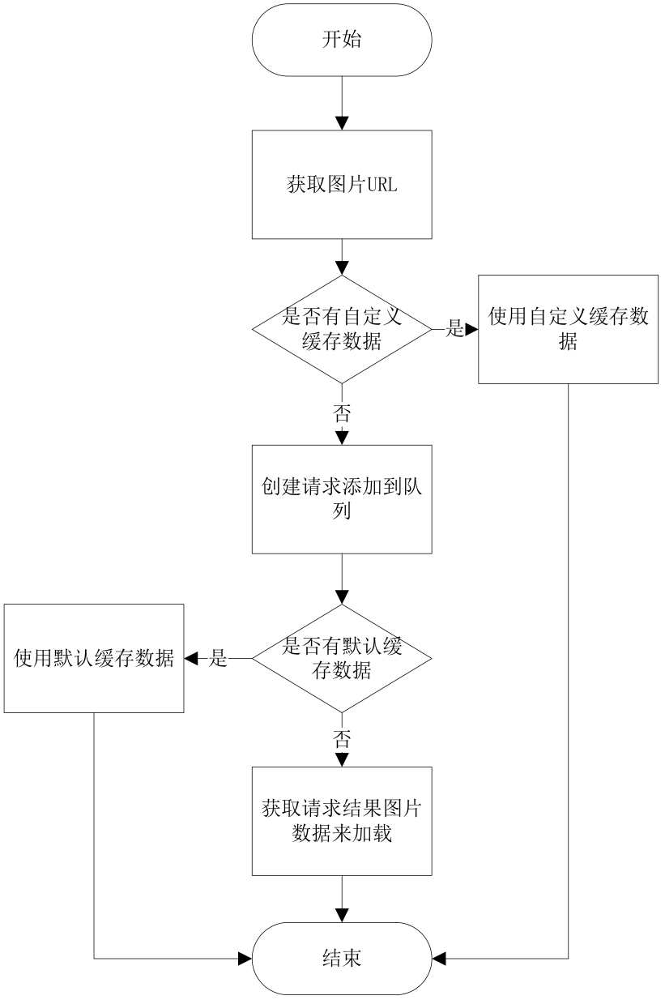

# Volley源码剖析

## 网络数据请求详解
在了解了Volley的基本使用之后我们都知道，不论是实现http请求，还是对网络图片做缓存加载，除了使用ImageLoader方式，都会经历几个主要步骤：  
1.使用Volley创建一个RequestQueue队列     
2.新建一个相应的Request    
3.将新建的Request添加到队列中   
###Volley.java类   
那么我们从Volley入手，来看看整个库是怎么工作的。   
我们打开Volley类。可以看到，Volley当中只有两个重载的方法newRequestQueue。用于创建一个请求队列。
一般我们默认使用newRequestQueue(Context context) 只传递一个context参数的方法。这个方法则是调用了上面两个参数的方法，后面的参数传递为null。   

在这个方法，主要做了几个事情：   
   1.设置默认的缓存文件夹      
   
```java    
   private static final String DEFAULT_CACHE_DIR = "volley";
   
   File cacheDir = new File(context.getCacheDir(), DEFAULT_CACHE_DIR);
```
   
   2.获取APP的包名，版本号，添加userAgent到请求头中，如果获取失败则默认使用Volley/0：   
   
   ```java    
   String userAgent = "volley/0";
        try {
            String packageName = context.getPackageName();
            PackageInfo info = context.getPackageManager().getPackageInfo(packageName, 0);
            userAgent = packageName + "/" + info.versionCode;
        } catch (NameNotFoundException e) {
        }
```

   3.对stack进行相关操作，得到NetWork对象。从这个代码段我们可以看出。如果stack为空得话volley会根据系统版本，选择对应的方式来创建。在2.3以前得版本，使用HttpClient来实现请求，在2.3及之后的版本则都是使用HttpUrlConnection来实现，具体实现思路大家可以回顾一下极客学院关于HttpClient和HttpUrlConnection的视频，查看HurlStack和HttpClientStack的源码来了解一下，这里就不再详细讲解。如果我们传递了自己自定义的stack 那么就直接使用。因此，如果你想要个性化自己来实现stack，就可以直接调用这个方法,自己新建一个Stack对象传递进来就可以。   
   
```java    
if (stack == null) {
            if (Build.VERSION.SDK_INT >= 9) {
                stack = new HurlStack();
            } else {
                // Prior to Gingerbread, HttpUrlConnection was unreliable.
                // See: http://android-developers.blogspot.com/2011/09/androids-http-clients.html
                stack = new HttpClientStack(AndroidHttpClient.newInstance(userAgent));
            }
        }

        Network network = new BasicNetwork(stack);
```

  4.最后，根据设定的缓存文件夹新建一个缓存对象，创建一个请求队列，参数为上面创建的缓存对象及NetWork对象，然后启动请求队列，同时将队列对象作为返回值返回，我们调用这个方法就会将返回值赋值给我们创建的全局队列对象。   
  
  ```java    
  RequestQueue queue = new RequestQueue(new DiskBasedCache(cacheDir), network);
  queue.start();
```

###RequestQueue.java   
接着，我们来看看RequestQueue这个类   
首先，看看它的构造函数：   

```java     
public RequestQueue(Cache cache, Network network) {
        this(cache, network, DEFAULT_NETWORK_THREAD_POOL_SIZE);
    }
```


```java     
public RequestQueue(Cache cache, Network network, int threadPoolSize) {
        this(cache, network, threadPoolSize,
                new ExecutorDelivery(new Handler(Looper.getMainLooper())));
    }
```

```java     
public RequestQueue(Cache cache, Network network, int threadPoolSize,
            ResponseDelivery delivery) {
        mCache = cache;
        mNetwork = network;
        mDispatchers = new NetworkDispatcher[threadPoolSize];
        mDelivery = delivery;
    }
```

它有三个重载的构造函数，从传递缓存对象，网络对象，衍生到设置并发请求数量，再到设置分发接口。   
这里，并发请求数量默认为4，我们也可以自己根据需要定义更多的并发数量。   
在构造函数中主要是设置一些初始值   
接着我们看start方法：   

```java    
public void start() {
        stop();  // Make sure any currently running dispatchers are stopped.
        // Create the cache dispatcher and start it.
        mCacheDispatcher = new CacheDispatcher(mCacheQueue, mNetworkQueue, mCache, mDelivery);
        mCacheDispatcher.start();
        // Create network dispatchers (and corresponding threads) up to the pool size.
        for (int i = 0; i < mDispatchers.length; i++) {
            NetworkDispatcher networkDispatcher = new NetworkDispatcher(mNetworkQueue, mNetwork,
                    mCache, mDelivery);
            mDispatchers[i] = networkDispatcher;
            networkDispatcher.start();
        }
    }    
```

首先，他会将现有队列停止掉，然后分别创建一个缓存线程以及我们所设定并发数量的网络线程。并且将他们启动。

调用完构造函数，我们会创建一些请求，添加到队列中，我们可以看看add函数：    

```java    
public <T> Request<T> add(Request<T> request) {
        // Tag the request as belonging to this queue and add it to the set of current requests.
        request.setRequestQueue(this);
        synchronized (mCurrentRequests) {
            mCurrentRequests.add(request);
        }

        // Process requests in the order they are added.
        request.setSequence(getSequenceNumber());
        request.addMarker("add-to-queue");

        // If the request is uncacheable, skip the cache queue and go straight to the network.
        if (!request.shouldCache()) {
            mNetworkQueue.add(request);
            return request;
        }

        // Insert request into stage if there's already a request with the same cache key in flight.
        synchronized (mWaitingRequests) {
            String cacheKey = request.getCacheKey();
            if (mWaitingRequests.containsKey(cacheKey)) {
                // There is already a request in flight. Queue up.
                Queue<Request<?>> stagedRequests = mWaitingRequests.get(cacheKey);
                if (stagedRequests == null) {
                    stagedRequests = new LinkedList<Request<?>>();
                }
                stagedRequests.add(request);
                mWaitingRequests.put(cacheKey, stagedRequests);
                if (VolleyLog.DEBUG) {
                    VolleyLog.v("Request for cacheKey=%s is in flight, putting on hold.", cacheKey);
                }
            } else {
                // Insert 'null' queue for this cacheKey, indicating there is now a request in
                // flight.
                mWaitingRequests.put(cacheKey, null);
                mCacheQueue.add(request);
            }
            return request;
        }
    }
```

这里主要做了几件事情：   
1.将请求添加到mCurrentRequests中，同时，给请求添加一个num编号，设置标签为以及添加到队列。   
2.会判断这个请求是否可以被缓存。如果不需要，直接添加到网络队列当中   
3.如果需要，就会取出这个请求的key值，判断等待队列中是否已经有同样的请求，就从当中取出，添加到队列中，如果没有，就创建一个空队列，并且讲请求添加到缓存队列中   
做完这些事情，我们在RequestQueue的start中所运行的2个主要对象mCacheDispatcher和networkDispatcher就开始起作用，他们分别是用户处理缓存队列中的请求以及网络队列中的请求。   
###NetworkDispatcher.java
首先，我们来看看networkDispatcher：   
它是继承于线程类，在run方法中主要做了几件事情：   
1.从网络队列中取到请求对象：   

```java    
Request<?> request;
            try {
                // Take a request from the queue.
                request = mQueue.take();
            } catch (InterruptedException e) {
                // We may have been interrupted because it was time to quit.
                if (mQuit) {
                    return;
                }
                continue;
            }
```

2.判断请求是否被取消了，如果已经被取消，直接关闭，继续拿下一个请求：   

```java    
if (request.isCanceled()) {
                    request.finish("network-discard-cancelled");
                    continue;
                }
```

3.执行请求，得到NetworkResponse，判断请求是否成功，如果失败了。将请求关闭，继续取下一个请求：   

```java    
NetworkResponse networkResponse = mNetwork.performRequest(request);
                request.addMarker("network-http-complete");
                // If the server returned 304 AND we delivered a response already,
                // we're done -- don't deliver a second identical response.
                if (networkResponse.notModified && request.hasHadResponseDelivered()) {
                    request.finish("not-modified");
                    continue;
                }
```

4.解析请求结果，同时判断这个请求是否允许缓存，如果允许，就使用缓存对象将请求结果保存起来，最后通过分发接口，讲请求结果分发出去   
这个是网络线程一直重复在做的事情，如果网络队列中的请求都执行完了。就会继续等待请求的加入继续执行。   

###CacheDispatcher   
接着我们看看缓存线程：   
它同样是继承于线程，在run中做了几件事：   
1.从缓存队列中取出请求对象：   

```java    
final Request<?> request = mCacheQueue.take();
request.addMarker("cache-queue-take");
```

2.判断请求是否被取消了，如果已经被取消，同样关闭请求，继续取下一个：

```java    
if (request.isCanceled()) {
                    request.finish("cache-discard-canceled");
                    continue;
                }
```

3.在缓存对象中取出这个请求的key所保存的缓存数据，判断是否有数据，如果没有就把请求添加到网络队列去继续请求：   

```java    
Cache.Entry entry = mCache.get(request.getCacheKey());
                if (entry == null) {
                    request.addMarker("cache-miss");
                    // Cache miss; send off to the network dispatcher.
                    mNetworkQueue.put(request);
                    continue;
                }
```

                
4.如果缓存数据已经失效，那么就将缓存数据对象设置到请求中，将请求添加到网络队列去更新缓存数据：   

```java    
if (entry.isExpired()) {
                    request.addMarker("cache-hit-expired");
                    request.setCacheEntry(entry);
                    mNetworkQueue.put(request);
                    continue;
                }
```

                
5.获取缓存数据的新旧程度，如果较新，就直接使用接口分发出去，如果是间隔比较久的缓存，会在分发的同时，将请求添加到网络队列中去更新缓存数据：   

```java    
request.addMarker("cache-hit");
                Response<?> response = request.parseNetworkResponse(
                        new NetworkResponse(entry.data, entry.responseHeaders));
                request.addMarker("cache-hit-parsed");
                if (!entry.refreshNeeded()) {
                    // Completely unexpired cache hit. Just deliver the response.
                    mDelivery.postResponse(request, response);
                } else {
                    // Soft-expired cache hit. We can deliver the cached response,
                    // but we need to also send the request to the network for
                    // refreshing.
                    request.addMarker("cache-hit-refresh-needed");
                    request.setCacheEntry(entry);
                    // Mark the response as intermediate.
                    response.intermediate = true;
                    // Post the intermediate response back to the user and have
                    // the delivery then forward the request along to the network.
                    mDelivery.postResponse(request, response, new Runnable() {
                        @Override
                        public void run() {
                            try {
                                mNetworkQueue.put(request);
                            } catch (InterruptedException e) {
                                // Not much we can do about this.
                            }
                        }
                    });
```

                    
以上就是缓存线程所在重复做的事情，同样会在缓存队列空的时候等待新请求进来继续执行。   

###Request   
接着，我们来看看最常使用到的请求类Request，它是一个抽象类，我们所使用的StringRequest，JsonRequest等都是继承于它来实现的，这里我们不详细讲解它的实现方式，我们以StringRequest为例来看看一个特定类型的请求是怎么实现的   
我们可以看到，它只有很少的一部分代码，包括两个重载的构造函数，以及2个重写的方法，parseNetworkResponse，以及deliverResponse。   
parseNetworkResponse主要用于将请求得到的数据转换成我们所需要的对应格式的数据，如StringRequest就是将请求结果转为String：   

```java    
@Override
    protected Response<String> parseNetworkResponse(NetworkResponse response) {
        String parsed;
        try {
            parsed = new String(response.data, HttpHeaderParser.parseCharset(response.headers));
        } catch (UnsupportedEncodingException e) {
            parsed = new String(response.data);
        }
        return Response.success(parsed, HttpHeaderParser.parseCacheHeaders(response));
    }
```

而deliverResponse则是将请求结果以对应的数据格式传递给回调：   

```java    
@Override
    protected void deliverResponse(String response) {
        mListener.onResponse(response);
    }
```

这里，我们不妨来定义一个返回xml格式的请求：   
我们在项目中新建一个XmlRequest，继承于Request:代码如下   

```java    
public class XmlRequest extends Request<XmlPullParser> {
	private final Listener<XmlPullParser> mListener;
	
	
	public XmlRequest(String url,Listener<XmlPullParser> listener, ErrorListener errorListener) {
		this(Method.GET,url,listener,errorListener);
		
	}
	public XmlRequest(int mothod,String url,Listener<XmlPullParser> listener, ErrorListener errorListener) {
		super(mothod, url, errorListener);  
        mListener = listener; 
	}

	@Override
	protected Response<XmlPullParser> parseNetworkResponse(
			NetworkResponse response) {
		try{
			String xmlString=new String(response.data,HttpHeaderParser.parseCharset(response.headers));
			XmlPullParserFactory factory=XmlPullParserFactory.newInstance();
			XmlPullParser xmlPullParser=factory.newPullParser();
			xmlPullParser.setInput(new StringReader(xmlString));
			return Response.success(xmlPullParser, HttpHeaderParser.parseCacheHeaders(response));
		}catch(UnsupportedEncodingException e){
			return Response.error(new ParseError(e));
		}catch (XmlPullParserException e) {
			return Response.error(new ParseError(e));
		}
	}

	@Override
	protected void deliverResponse(XmlPullParser response) {
		mListener.onResponse(response);
	}

}
```

这样，我们就可以根据自己的需要定制自己想要的数据类型。我们也可以使用第三方库gson之类，直接将结果映射到实体上，定制出更加方便的请求。
## 网络图片缓存加载详解   
接下来，我们来看看关于网络图片缓存加载的相关源码
###ImageRequest   
首先我们来看看ImageRequest，它是继承于Request的类，我们从前面的解析就能知道，ImageRequest是定制了Bitmap格式返回数据的请求，主要是对图片数据的一些处理，我们就不详细介绍。   

###ImageLoader   
那么我们来看看ImageLoader，使用ImageLoader是大部分人使用Volley来加载图片的方式，我们从构造函数入手：   

```java    
    public ImageLoader(RequestQueue queue, ImageCache imageCache) {
        mRequestQueue = queue;
        mCache = imageCache;
    }
```

这里一般我们传入的是我们新建的ImageCache，大部分情况下我们都没做相关的操作，我们接着从get方法来看：   

    
主要有两个重载方式，一个有设置最大宽高，一个则默认没有，在这里，主要做几件事：   
1.判断加载的图片url是否在缓存中有数据，如果有，就取出来，通过接口分发出去,需要注意的是，这里所使用的是我们所新建的缓存对象，如果你默认没做处理，这里都是没有缓存数据，需要通过后面新建图片请求，来判断请求是否有缓存并返回：   

```java    
        final String cacheKey = getCacheKey(requestUrl, maxWidth, maxHeight);
        // Try to look up the request in the cache of remote images.
        Bitmap cachedBitmap = mCache.getBitmap(cacheKey);
        if (cachedBitmap != null) {
            // Return the cached bitmap.
            ImageContainer container = new ImageContainer(cachedBitmap, requestUrl, null, null);
            imageListener.onResponse(container, true);
            return container;
        }
```

2.如果不存在缓存，先告诉传递空数据，让它知道要加载默认图片：   

```java    
        ImageContainer imageContainer =
                new ImageContainer(null, requestUrl, cacheKey, imageListener);
        // Update the caller to let them know that they should use the default bitmap.
        imageListener.onResponse(imageContainer, true);
```

```java    
    public static ImageListener getImageListener(final ImageView view,
            final int defaultImageResId, final int errorImageResId) {
        return new ImageListener() {
            @Override
            public void onErrorResponse(VolleyError error) {
                if (errorImageResId != 0) {
                    view.setImageResource(errorImageResId);
                }
            }
            @Override
            public void onResponse(ImageContainer response, boolean isImmediate) {
                if (response.getBitmap() != null) {
                    view.setImageBitmap(response.getBitmap());
                } else if (defaultImageResId != 0) {
                    view.setImageResource(defaultImageResId);
                }
            }
        };
    }
```

3.判断这个url是否已经存在请求队列中，如果存在，就等待请求，不继续操作：   

```java    
        BatchedImageRequest request = mInFlightRequests.get(cacheKey);
        if (request != null) {
            // If it is, add this request to the list of listeners.
            request.addContainer(imageContainer);
            return imageContainer;
        }
```

4.如果不存在，创建一个请求，添加到队列中：   

```java    
        Request<Bitmap> newRequest = makeImageRequest(requestUrl, maxWidth, maxHeight, cacheKey);
        mRequestQueue.add(newRequest);
        mInFlightRequests.put(cacheKey,
                new BatchedImageRequest(newRequest, imageContainer));
        return imageContainer;
``` 

```java    
    protected Request<Bitmap> makeImageRequest(String requestUrl, int maxWidth, int maxHeight, final String cacheKey) {
        return new ImageRequest(requestUrl, new Listener<Bitmap>() {
            @Override
            public void onResponse(Bitmap response) {
                onGetImageSuccess(cacheKey, response);
            }
        }, maxWidth, maxHeight,
        Config.RGB_565, new ErrorListener() {
            @Override
            public void onErrorResponse(VolleyError error) {
                onGetImageError(cacheKey, error);
            }
        });
    }
```

在获取数据成功之后，就会调用我们创建的cache对象来保存缓存数据，如果我们不做操作，则默认会在请求那边来保存缓存。   

```java    
    protected void onGetImageSuccess(String cacheKey, Bitmap response) {
        // cache the image that was fetched.
        mCache.putBitmap(cacheKey, response);
        // remove the request from the list of in-flight requests.
        BatchedImageRequest request = mInFlightRequests.remove(cacheKey);
        if (request != null) {
            // Update the response bitmap.
            request.mResponseBitmap = response;
            // Send the batched response
            batchResponse(cacheKey, request);
        }
    }
```

这里，我们可以看出ImageLoader的缓存流程是这样的：



Volley默认使用的是缓存到SD卡的方式，对于缓存图片来说，我们更喜欢缓存到内存上，因此，我们就可以通过自定义缓存的方式，来加大缓存图片的效率。我们可以新建一个内存缓存 LruBitmapCache：   

```java    
public class LruBitmapCache implements ImageCache {  
    private LruCache<String, Bitmap> mCache;  
    public LruBitmapCache() {  
        int maxSize = 10 * 1024 * 1024;  
        mCache = new LruCache<String, Bitmap>(maxSize) {  
            @Override  
            protected int sizeOf(String key, Bitmap bitmap) {  
                return bitmap.getRowBytes() * bitmap.getHeight();  
            }  
        };  
    }  
    @Override  
    public Bitmap getBitmap(String url) {  
        return mCache.get(url);  
    }  
    @Override  
    public void putBitmap(String url, Bitmap bitmap) {  
        mCache.put(url, bitmap);  
    }  
}  
```

在使用ImageLoader的时候只要使用这个缓存作为参数就可以：   

```java    
ImageLoader imageLoader = new ImageLoader(mQueue, new LruBitmapCache()); 
```
###NetworkImageView   
最后，我们来看看Volley提供的自定义控件NetworkImageView   
它是继承于ImageView 的自定义控件，在当中加入了设置默认图片及错误图片等方法，通过setImageUrl方法，传递ImageLoader对象，通过ImageLoader对象来加载。这里我们就不做太多介绍。   

##总结   
通过了解Volley的一些重要类的源码之后，我们都被谷歌工程师强大的逻辑和灵活的代码结构给折服了，我们可以从中学习到很多扩展性强大的代码设计方式。   
目前我们所讲解的仅仅是初步的源码分析，如果有兴趣大家也可以继续深入，把最内层的实现都分析清楚。研究完源码，不妨尝试着自己来封装一个类似的库出来。一步步完善。这就是开源的乐趣。